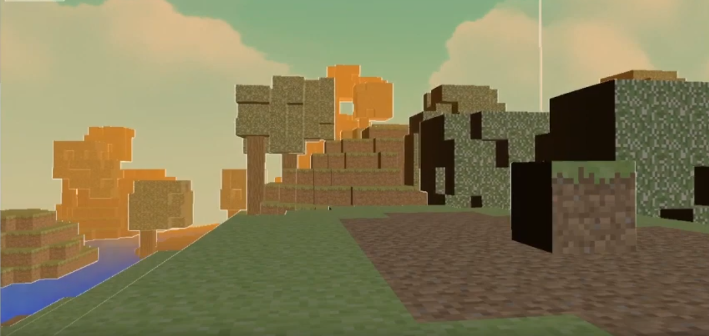
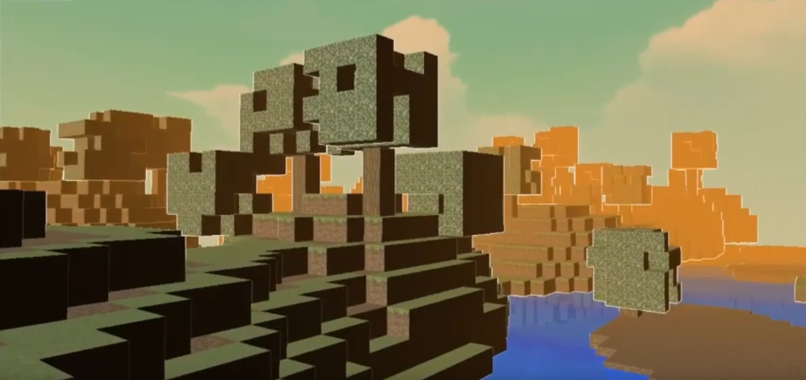
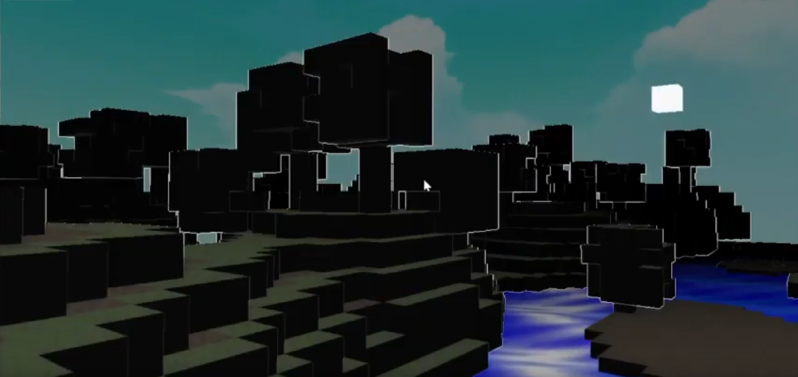
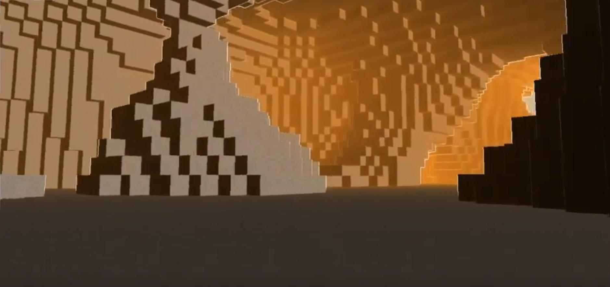
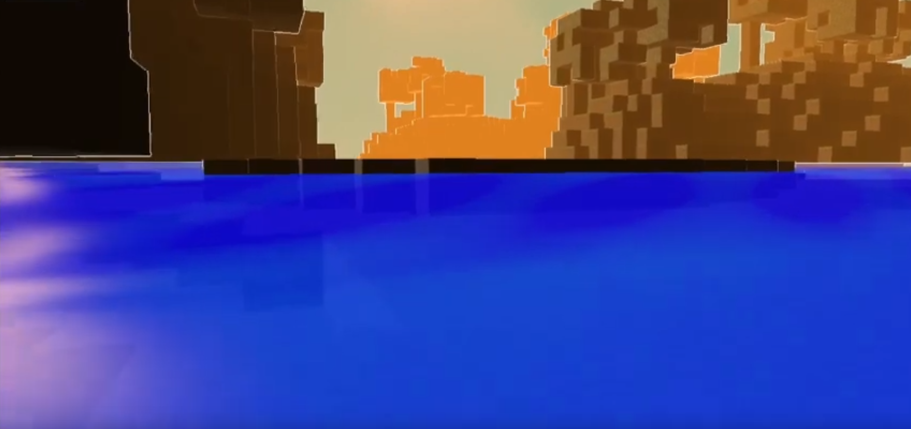

<h1 align="center">  Minicraft </h1>

  
  

  
  
  

Trailer : https://www.youtube.com/watch?v=0yXIqEj37sA

Made in CNAM-ENJMIN.

We had to do a replica of Minecraft using C++, OpenGL and our teacher's  Guillaume LeVieux's engine that helped us speed up the process

Our basic implementation was :

- Create a map of cubes using perlin noise
- Create a camera and movements
- Create a basic water and post processing shader

What I did on top of that : 

- Procedurally generated trees with their own shaders
- Redid the terrain to my liking
- Textures with correct color and lightning
- A skybox using cubemaps
- (I tried to add rain particles but it proved to be too difficult)

